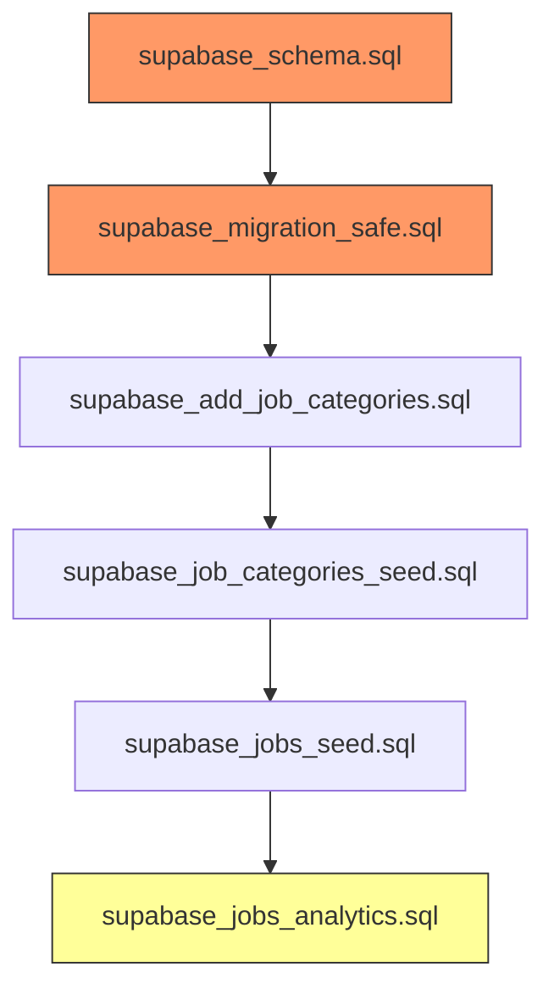

# Jobs DB System - Complete Documentation

> **Generated:** 2026-05-27  
> **Project:** UtilityTools (Supabase + React)  
> **Purpose:** Document all database tables, schemas, seed data, and identify duplicate/unwanted rows related to the Jobs system.

---

## 1. Database Tables Overview

### 1.1 Main Job Tables

| Table | Purpose | Created In |
|-------|---------|------------|
| `jobs` | Core jobs/recruitment listings | `supabase_schema.sql`, `supabase_migration_safe.sql` |
| `job_categories` | Job category taxonomy (e.g., Government, IT, Banking) | `supabase_add_job_categories.sql` |
| `job_analytics_events` | Detailed per-job analytics (views, clicks) | `supabase_jobs_analytics.sql` |

### 1.2 Related Tables (Not Job-Specific But Used by Jobs)

| Table | Relationship |
|-------|-------------|
| `categories` | General tool categories — **not** used by jobs |
| `admin_users` | Controls admin RLS access for managing jobs |

---

## 2. `jobs` Table Schema

Defined in: `supabase_schema.sql` (lines 186–218) and `supabase_migration_safe.sql` (lines 30–61).

> ⚠️ **ISSUE:** The `jobs` table is **defined twice** — once in `supabase_schema.sql` and once in `supabase_migration_safe.sql`. Both use `create table if not exists`, so only the first execution takes effect, but this creates maintenance confusion.

### Columns

| Column | Type | Constraints | Notes |
|--------|------|-------------|-------|
| `id` | `uuid` | PK, default `uuid_generate_v4()` | |
| `title` | `text` | NOT NULL | Job title |
| `slug` | `text` | UNIQUE, NOT NULL | URL-friendly identifier |
| `organization` | `text` | nullable | Employer name |
| `category` | `text` | nullable | Free-text category (e.g., "Government Jobs") |
| `job_type` | `text` | nullable | e.g., "Full Time" |
| `location` | `text` | nullable | |
| `qualification` | `text` | nullable | |
| `experience` | `text` | nullable | |
| `salary` | `text` | nullable | |
| `application_start_date` | `date` | nullable | |
| `last_date` | `date` | nullable | Application deadline |
| `official_website` | `text` | nullable | |
| `apply_link` | `text` | nullable | |
| `notification_pdf` | `text` | nullable | |
| `short_description` | `text` | nullable | |
| `full_description` | `text` | nullable | |
| `eligibility` | `jsonb` | nullable | |
| `selection_process` | `jsonb` | nullable | |
| `important_dates` | `jsonb` | nullable | |
| `application_fee` | `text` | nullable | |
| `tags` | `jsonb` | nullable | Array of string tags |
| `featured` | `boolean` | default `false` | |
| `status` | `text` | default `'draft'` | |
| `seo_title` | `text` | nullable | |
| `seo_description` | `text` | nullable | |
| `seo_keywords` | `text` | nullable | Added separately (line 223) |
| `canonical_url` | `text` | nullable | |
| `og_image` | `text` | nullable | |
| `views_count` | `integer` | default `0` | Added in `supabase_jobs_analytics.sql` |
| `apply_clicks` | `integer` | default `0` | Added in `supabase_jobs_analytics.sql` |
| `last_viewed_at` | `timestamptz` | nullable | Added in `supabase_jobs_analytics.sql` |
| `created_at` | `timestamptz` | NOT NULL, default `now()` | |
| `updated_at` | `timestamptz` | NOT NULL, default `now()` | |

### Indexes

```sql
CREATE INDEX IF NOT EXISTS idx_jobs_status ON jobs (status);
CREATE INDEX IF NOT EXISTS idx_jobs_last_date ON jobs (last_date DESC);
CREATE INDEX IF NOT EXISTS idx_jobs_featured ON jobs (featured);
```

### Row-Level Security (RLS) Policies

Defined in both `supabase_schema.sql` and `supabase_migration_safe.sql`:

```sql
-- Public read: only published jobs
CREATE POLICY "Allow public select published jobs"
  ON jobs FOR SELECT
  USING (status = 'published' OR EXISTS (SELECT 1 FROM admin_users WHERE id = auth.uid() AND is_admin = true));

-- Admin full access
CREATE POLICY "Allow admin manage jobs"
  ON jobs FOR INSERT, UPDATE, DELETE
  USING (EXISTS (SELECT 1 FROM admin_users WHERE id = auth.uid() AND is_admin = true));
```

---

## 3. `job_categories` Table Schema

Defined in: `supabase_add_job_categories.sql`

| Column | Type | Constraints |
|--------|------|-------------|
| `id` | `bigserial` | PK |
| `name` | `text` | NOT NULL |
| `slug` | `text` | UNIQUE, NOT NULL |
| `description` | `text` | nullable |
| `color` | `text` | default `'#6366f1'` |
| `icon` | `text` | default `'briefcase'` |
| `featured` | `boolean` | default `false` |
| `sort_order` | `integer` | default `0` |
| `created_at` | `timestamptz` | default `now()` |

### Seeded Categories (from `supabase_job_categories_seed.sql`)

| Name | Slug | Featured |
|------|------|----------|
| Government Jobs | `government-jobs` | ✅ |
| Private Jobs | `private-jobs` | |
| IT Jobs | `it-jobs` | ✅ |
| Remote Jobs | `remote-jobs` | |
| Banking Jobs | `banking-jobs` | |
| Railway Jobs | `railway-jobs` | |
| Internship | `internship` | |
| Freshers Jobs | `freshers-jobs` | |

> ⚠️ **ISSUE:** There are **two separate category systems**:
> - `jobs.category` (free-text column in the `jobs` table) — e.g., "Government Jobs"
> - `job_categories` table — structured taxonomy with slug, color, icon
>   
> These are **not linked by foreign key**. This creates potential inconsistency (e.g., a job could have `category = 'Govt Jobs'` while the `job_categories` table has `slug = 'government-jobs'`).

---

## 4. `job_analytics_events` Table Schema

Defined in: `supabase_jobs_analytics.sql`

| Column | Type | Constraints |
|--------|------|-------------|
| `id` | `uuid` | PK, default `gen_random_uuid()` |
| `job_id` | `uuid` | FK → `jobs(id)` ON DELETE CASCADE |
| `event_type` | `text` | NOT NULL |
| `user_agent` | `text` | nullable |
| `ip_address` | `text` | nullable |
| `referrer` | `text` | nullable |
| `session_id` | `text` | nullable |
| `created_at` | `timestamptz` | default `now()` |

### Trigger

```sql
-- Auto-updates jobs.last_viewed_at when a 'view' event is inserted
CREATE TRIGGER trg_update_job_last_viewed
  AFTER INSERT ON job_analytics_events
  FOR EACH ROW
  WHEN (new.event_type = 'view')
  EXECUTE FUNCTION update_job_last_viewed();
```

---

## 5. Seed Data — Existing Job Rows

Only **one seeded job** exists (from `supabase_jobs_seed.sql`):

| Field | Value |
|-------|-------|
| `id` | `99999999-9999-4999-9999-999999999999` |
| `title` | SSC CGL Recruitment 2026 |
| `slug` | `ssc-cgl-recruitment-2026` |
| `organization` | Staff Selection Commission (SSC) |
| `category` | Government Jobs |
| `status` | `published` |
| `featured` | `true` |

**There are NO other job seed rows.** Only 1 published seed job exists.

---

## 6. Identified Issues & Unwanted Duplication

### 🔴 Issue 1: Table Created in 2 Separate Migration Files
- `supabase_schema.sql` (lines 186–218) — full schema definition
- `supabase_migration_safe.sql` (lines 30–61) — duplicate definition with `IF NOT EXISTS`
- **Impact:** Low (safe due to `IF NOT EXISTS`), but confusing for maintenance

### 🔴 Issue 2: Columns Added in 3+ Files
- Base schema columns: `supabase_schema.sql`
- `seo_keywords` added: `supabase_schema.sql` line 223
- `views_count`, `apply_clicks`, `last_viewed_at` added: `supabase_jobs_analytics.sql`
- **Impact:** Low, but the schema is fragmented across multiple files

### 🔴 Issue 3: Two Category Systems (Text Field vs Separate Table)
- `jobs.category` is a free-text `text` field
- `job_categories` is a structured separate table
- **No foreign key or relationship** between them
- **Impact:** Potential data inconsistency — jobs could reference category names that don't exist in `job_categories`, or vice versa

### 🔴 Issue 4: Duplicate RLS Policy Definitions
- Jobs RLS policies defined in both `supabase_schema.sql` and `supabase_migration_safe.sql`
- Policies are dropped and recreated, so only the latest definition sticks
- **Impact:** Low, but indicates lack of a single source of truth

### 🟡 Issue 5: No Foreign Key Between `jobs` and `job_categories`
- `jobs.category` uses a text label (e.g., "Government Jobs")
- `job_categories` has structured rows with slugs
- No FK constraint exists, so referential integrity is not enforced

### 🟡 Issue 6: Analytics Events Table is Separate
- `job_analytics_events` table stores granular analytics
- But some analytics counters (`views_count`, `apply_clicks`) are also directly on `jobs`
- **Impact:** Two data sources for similar metrics — possible inconsistency

---

## 7. Frontend Code Architecture (JS/React)

### Pages
| File | Purpose |
|------|---------|
| `src/pages/jobs/JobsListPage.jsx` | Public job listing with filters |
| `src/pages/jobs/JobDetailPage.jsx` | Single job detail view |
| `src/pages/jobs/JobsCategoryPage.jsx` | Jobs filtered by category |
| `src/pages/admin/jobs/AdminJobs.jsx` | Admin CRUD for jobs |
| `src/pages/admin/AdminJobCategories.jsx` | Admin CRUD for job categories |

### Components
| Directory | Count | Purpose |
|-----------|-------|---------|
| `src/components/jobs/` | 7 components | Public-facing: JobCard, JobMeta, FeaturedJobs, RelatedJobs, etc. |
| `src/components/jobs/admin/` | 1 component | `JobAnalyticsDashboard.jsx` |
| `src/components/jobs/empty-states/` | 4 components | Empty state UIs for various job views |
| `src/components/jobs/skeletons/` | 4 components | Loading skeletons |
| `src/components/admin/jobs/` | 3 components | Admin: JobEditor, JobFilters, JobStatusBadge |

### Hooks
| File | Purpose |
|------|---------|
| `src/hooks/jobs/useJobs.js` | Fetch job listings, search, featured jobs |
| `src/hooks/jobs/useJobCategories.js` | Fetch job categories |
| `src/hooks/jobs/useAdminJobs.js` | Admin CRUD operations |
| `src/hooks/jobs/useJobAnalytics.js` | Analytics data fetching |

### API & Utilities
| File | Purpose |
|------|---------|
| `src/api/jobDebugUtils.js` | Debug utilities for diagnosing duplicate slugs, bad JSON, etc. |
| `src/lib/jobs/` | Helpers: `jobHelpers.js`, `jobAnalytics.js`, `jobOGImage.js`, `jobRelations.js`, `jobToasts.js` |
| `src/utils/jobs/jobSeo.jsx` | SEO utility for job pages |

---

## 8. Content Tools Related to Jobs

The project has 5 content tools (SSC, Bank, Railway, Volumetric, Amazon), but only some are job-related:

| Tool File | Job-Related? | Exam Type |
|-----------|-------------|-----------|
| `CONTENT_TOOL_1_VOLUMETRIC.md` | ❌ (general volumetric calculator) | — |
| `CONTENT_TOOL_2_AMAZON.md` | ❌ (Amazon product tools) | — |
| `CONTENT_TOOL_3_RAILWAY.md` | ✅ | Indian Railway Exams |
| `CONTENT_TOOL_4_SSC.md` | ✅ | SSC Exams (CGL, CHSL, MTS, CPO) |
| `CONTENT_TOOL_5_BANK.md` | ✅ | Banking Exams (IBPS, SBI, RBI) |

These content tools are for the **tools/calculators** portion of the site (e.g., photo resizer for SSC), not the **jobs listing** system. They are separate features.

---

## 9. Summary of Duplicate/Unwanted Rows

| Category | Count | Details |
|----------|-------|---------|
| **Job seed rows in DB** | **1** | Only `ssc-cgl-recruitment-2026` |
| **Job category seed rows** | **8** | Government, Private, IT, Remote, Banking, Railway, Internship, Freshers |
| **SQL files defining jobs table** | **2** | Should be consolidated to 1 |
| **SQL files adding job columns** | **3** | Should be consolidated to 1 |
| **RLS policy definitions** | **2** | Same policies in 2 files |
| **Job category systems** | **2** | Free-text field + separate table (no FK link) |

### Recommended Actions

1. ✅ **Consolidate schema definitions** — Move all `jobs` table definitions into a single migration file
2. ✅ **Link `jobs.category` to `job_categories`** — Add a `category_id` FK column referencing `job_categories.id`
3. ✅ **Remove duplicate column additions** — Combine all `ALTER TABLE` statements into one migration
4. ⚠️ **Decide on analytics strategy** — Choose between counters on `jobs` table vs. `job_analytics_events`; currently both exist
5. ✅ **Consolidate RLS policies** — Define job policies only in one place

---

## 10. Execution Order of SQL Migrations (Current State)



- 🔴 `supabase_schema.sql` and `supabase_migration_safe.sql` both create the `jobs` table
- 🟡 `supabase_jobs_analytics.sql` adds columns to `jobs` AFTER it may already have data
- ✅ All seed files use `ON CONFLICT DO NOTHING` / `ON CONFLICT DO UPDATE` for idempotency

---

## 11. Key Files Reference

| File | Role |
|------|------|
| `supabase_schema.sql` | Primary schema (1227 lines — includes jobs, blog, tools, analytics) |
| `supabase_migration_safe.sql` | Secondary safe migration (423 lines — overlaps with schema.sql) |
| `supabase_add_job_categories.sql` | Creates `job_categories` table |
| `supabase_job_categories_seed.sql` | Seeds 8 job categories |
| `supabase_jobs_seed.sql` | Seeds 1 sample job (SSC CGL 2026) |
| `supabase_jobs_analytics.sql` | Adds analytics tracking to jobs |
| `src/api/jobDebugUtils.js` | Debug utilities for diagnosing job DB issues |
| `src/hooks/jobs/useJobs.js` | React hooks for fetching jobs |
| `src/components/jobs/` | All public job components |
| `src/pages/jobs/` | Public job pages |
| `src/pages/admin/jobs/` | Admin job management pages |